# 【深度强化学习】马尔科夫决策过程

【DataWhale打卡】周博磊博士-第二节马尔科夫决策过程，主要内容：

- 马尔科夫链、马尔科夫奖励过程、马尔科夫决策过程
- Policy evaluation in MDP
- Control in MDP: policy iteration & value iteration 

[TOC]

## 一、引入

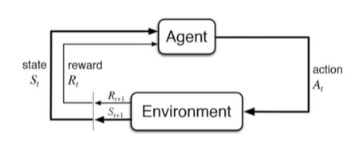

Agent 在得到环境的状态过后，它会采取行为，它会把这个采取的行为返还给环境。环境在得到 agent 的行为过后，它会进入下一个状态，把下一个状态传回 agent。

在强化学习中，这个交互过程是可以通过马尔可夫决策过程来表示的，所以马尔可夫决策过程是强化学习里面的一个基本框架。

在马尔可夫决策过程中，它的环境是 `fully observable` ，就是全部可以观测的。但是很多时候环境里面有些量是不可观测的，但是这个部分观测的问题也可以转换成一个 MDP 的问题。

## 二、Markov Process(MP)

### Markov Property

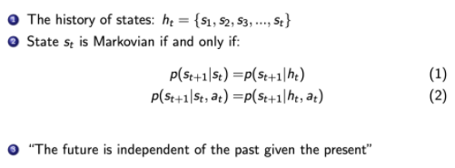

如果一个状态转移是符合马尔可夫的，那就是说一个状态的下一个状态只取决于它当前状态，而跟它当前状态之前的状态都没有关系。
如果某一个过程满足`马尔可夫性质(Markov Property)`，就是说未来的转移跟过去是独立的，它只取决于现在。**马尔可夫性质是所有马尔可夫过程的基础。**

### Markov Chain

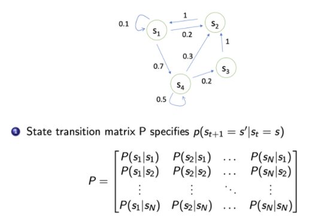

我们可以用`状态转移矩阵(State Transition Matrix)`来描述这样的状态转移。状态转移矩阵类似于一个 conditional probability，当我们知道当前我们在 s_tst 这个状态过后，到达下面所有状态的一个概念。所以它每一行其实描述了是从一个节点到达所有其它节点的概率。

## 三、Markov Reward Process(MRP)

**`马尔可夫奖励过程(Markov Reward Process, MRP)` 是马尔可夫链再加上了一个奖励函数。**

在 MRP 中，转移矩阵跟它的这个状态都是跟马尔可夫链一样的，多了一个`奖励函数(reward function)`。

**奖励函数是一个期望**，就是说当你到达某一个状态的时候，可以获得多大的奖励，然后这里另外定义了一个 discount factor \gammaγ 。

### Return & Value function

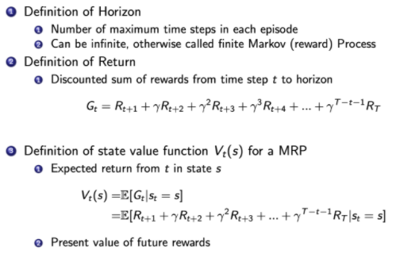

- `horizon` 
  - 它说明了同一个 episode 或者是整个一个轨迹的长度
  - 它是由有限个步数决定的。
- `return`的定义
  - Return 说的是我们把奖励进行折扣，然后获得的这个收益。
  - Return 可以定义为奖励的逐步叠加，然后这里有一个叠加系数$\gamma$，就是越往后得到的奖励，折扣得越多。
  - 这说明我们其实更希望得到现有的奖励，未来的奖励就要把它打折扣。
- `state value function`
  - 然后对于这个MRP，它里面定义成是关于这个 return 的期望， $G_t$ 是我们之前定义的 `discounted return`。
  - 我们这里取了一个期望，期望就是说从这个状态开始，你有可能获得多大的价值。
  - 所以这个期望也可以看成是一个对未来可能获得奖励的它的当前价值的一个表现。就是当你进入某一个状态过后，你现在就有多大的价值。

### 关于$\gamma$的解释

   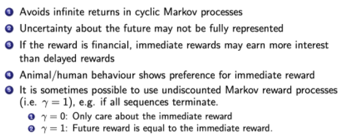

**这里我们解释一下为什么需要 discount factor。**

- 有些马尔可夫过程是**带环**的，它并没有终结，我们想**避免这个无穷的奖励**。
- 我们并没有建立一个完美的模拟环境的模型，也就是说，我们对未来的评估不一定是准确的，**我们不一定完全信任我们的模型**，因为这种不确定性，所以我们对未来的预估增加一个折扣。我们想把这个**不确定性表示出来**，希望尽可能快地得到奖励，而不是在未来某一个点得到奖励。
- 如果这个奖励是有**实际价值**的，我们可能是更希望立刻就得到奖励，而不是后面再得到奖励（现在的钱比以后的钱更有价值）。
- 在人的行为里面来说的话，大家也是想得到**即时奖励**。
- 有些时候可以把这个系数设为 0，设为 0 过后，我们就只关注了它当前的奖励。我们也可以把它设为 1，设为 1 的话就是对未来并没有折扣，未来获得的奖励跟当前获得的奖励是一样的。

### Value Funtion计算方法

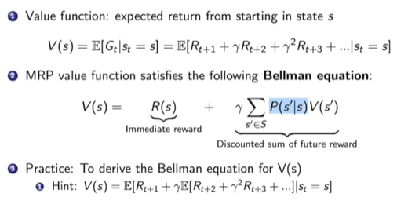

**蒙特卡罗采样法**：比如计算$V(s_4)$的值，那么就采样从s4开始很多轨迹，到最终的价值，平均一下作为value值。

**贝尔曼等式**：**Bellman Equation 定义了当前状态跟未来状态之间的这个关系**。

- s′ 可以看成未来的所有状态。
- 转移 P(s'|s) 是指从当前状态转移到未来状态的概率。
- 第二部分可以看成是一个 Discounted sum of future reward。
- V(s')  代表的是未来某一个状态的价值。我们从当前这个位置开始，有一定的概率去到未来的所有状态，所以我们要把这个概率也写上去，这个转移矩阵也写上去，然后我们就得到了未来状态，然后再乘以一个 $\gamma$，这样就可以把未来的奖励打折扣。

未来打了折扣的奖励加上当前立刻可以得到的奖励，就组成了这个 Bellman Equation。Bellman Equation 的推导过程如下：

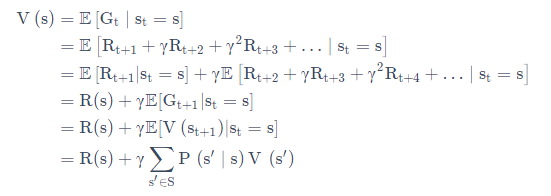

> Bellman Equation 就是当前状态与未来状态的迭代关系，表示当前状态的值函数可以通过下个状态的值函数来计算。
>
> Bellman Equation 因其提出者、动态规划创始人 Richard Bellman 而得名 ，也叫作“动态规划方程”。

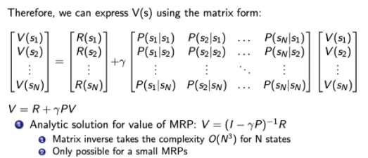

可以把 Bellman Equation 写成一种矩阵的形式。首先有这个转移矩阵。我们当前这个状态是一个向量 $[V(s_1),V(s_2),\cdots,V(s_N)]^T$。我们可以写成迭代的形式。我们每一行来看的话，V这个向量乘以了转移矩阵里面的某一行，再加上它当前可以得到的 reward，就会得到它当前的价值。

当我们写成如下的矩阵形式后:

$$
V = R+γPV
$$

就可以直接得到一个`解析解(analytic solution)`:

$$
V=(I-\gamma P)^{-1} R
$$

通过矩阵求逆的过程把这个 V 的这个价值直接求出来。但是一个问题是这个矩阵求逆的过程的复杂度是 $O(N^3)$。在量级很大的时候，求解难度很大。只适合于小量的MRP。

### 通过迭代法解决大型的MRP

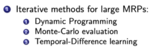

- 通过动态规划的方法，
- 通过蒙特卡罗的办法，就通过采样的办法去计算它，
- 通过 Temporal-Difference Learning 的办法。这个 `Temporal-Difference Learning` 叫 `TD Leanring`，它是动态规划和蒙特卡罗的一个结合。

#### 1. Monte Carlo(MC)

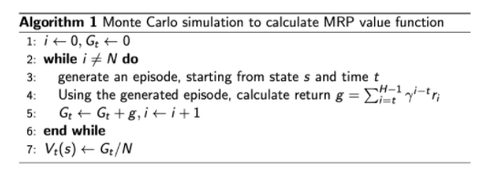

和上文类似，相同的意思，采样，然后取平均。

#### 2. Dynamic Programming(DP)

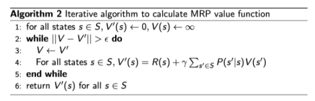

**用这个动态规划的办法**，一直去迭代它的 Bellman Equation，让它最后收敛，我们就可以得到它的一个状态。

当这个最后更新的状态跟你上一个状态变化并不大的时候，更新就可以停止，我们就可以输出最新的 V'(s)V′(s) 作为它当前的状态。

> 动态规划的方法基于后继状态值的估计来更新状态值的估计（算法二中的第 3 行用 V' 来更新 V ）。也就是说，它们根据其他估算值来更新估算值。我们称这种基本思想为 bootstrapping。

## 四、Markov Decision Process(MDP)

### MDP定义

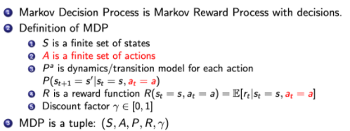

**相对于 MRP，`马尔可夫决策过程(Markov Decision Process)`多了一个 `decision`，其它的定义跟 MRP 都是类似的。**

这里多了一个决策，多了一个 action ，那么这个状态转移也多了一个 condition，就是你采取某一种行为，然后你未来的状态会不同。

它不仅是依赖于你当前的状态，也依赖于在当前状态你这个 agent 它采取的这个行为会决定它未来的这个状态走向。

对于这个价值函数，它也是多了一个条件，多了一个你当前的这个行为，就是说你当前的状态以及你采取的行为会决定你在当前可能得到的奖励多少。

### Policy in MDP

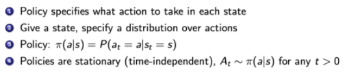

**Policy 定义了在某一个状态应该采取什么样的行为。**

当我们知道当前状态过后，可以带入这个 policy function，那我们会得到一个概率，概率就代表了在所有可能的行为里面怎样去采取行动。

这个策略也可能是确定的，它有可能是直接输出一个值，或者就直接告诉你当前应该采取什么样的行为，而不是一个行为的概率。

这里有一个假设，就是这个概率函数应该是静态的(stationary)，不同时间点，采取的行为其实都是对这个 policy function 进行采样。

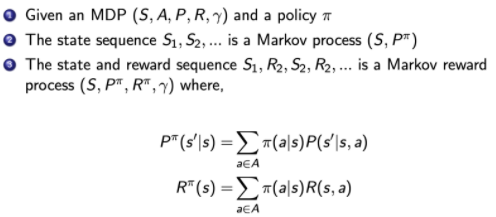

**这里说明了 MDP 跟 MRP 的之间的一个转换。**已知一个 MDP 和一个 policy \piπ 的时候，我们可以把 MDP 转换成 MRP。

在 MDP 里面，转移函数 P(s'|s,a) 是基于它当前状态以及它当前的 action。因为我们现在已知它 policy function，就是说在每一个状态，我们知道它可能采取的行为的概率，那么就可以直接把这个 action 进行加和，直接把这个 a 去掉，那我们就可以得到对于 MRP 的一个转移，这里就没有 action。

对于这个奖励函数，我们也可以把 action 拿掉，这样就会得到一个类似于 MRP 的奖励函数。

### Comparison of MP、MRP & MDP

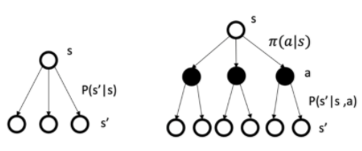

**MDP 里面的状态转移跟 MRP 以及 MP 的差异**

- 马尔可夫过程的转移是直接就决定。比如当前状态是 s，那么就直接通过这个转移概率决定了下一个状态是什么。

- 但对于 MDP，它的中间多了一层这个行为 a 
  - 就是说在你当前这个状态的时候，首先要决定的是采取某一种行为，那么你会到了某一个黑色的节点。到了这个黑色的节点，因为你有一定的不确定性，当你当前状态决定过后以及你当前采取的行为过后，你到未来的状态其实也是一个概率分布。
  - **在这个当前状态跟未来状态转移过程中这里多了一层决策性，这是 MDP 跟之前的马尔可夫过程很不同的一个地方。**在马尔可夫决策过程中，行为是由 agent 决定，所以多了一个 component，agent 会采取行为来决定未来的状态转移。

