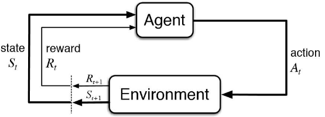

# 强化学习纲要-基础部分

【DataWhale打卡】第一天：学习周博磊讲的强化学习结合《深入理解AutoML和AutoDL》这本书中的强化学习的章节总结了基础部分。

参考资料：https://github.com/zhoubolei/introRL

先导课程：线性代数、概率论、机器学习/数据挖掘/深度学习/模式识别

编程基础：Python, PyTorch

## 强化学习在做什么？

强化学习和监督学习有很大的区别：

1. 监督学习需要提供数据和对应的标签，训练数据和测试数据是独立同分布的，从而进行模式和特征的学习。

2. 强化学习不同，强化学习没有直接的标签进行指导，并且数据不是独立同分布的，前后数据有比较强的关系。强化学习可以在环境中进行探索和试错，根据实验的结果提取经验，从而学习到最佳策略。

|           | 监督学习     | 无监督学习 | 强化学习 |
| --------- | ------------ | ---------- | -------- |
| 输出值    | 标签         | 无         | 奖励值   |
| 标签/奖励 | 人类提供标注 | 无标签     | 延迟奖励 |
| 经验      | 无           | 无         | 有       |
| 损失值    | 有           | 无         | 无       |
| 输入      | 独立同分布   | 独立同分布 | 前后依赖 |

**强化学习的目标**是训练一个agent，能够在不同的情况做出最佳的action，从而让系统给出的reward值最大化。

**流程如下**：agent会观察环境得到observation（state），然会采取一个action，环境受到这个action的作用，会反馈给agent一个reward，同时环境状态state也发生了改变。循环往复，agent目标是为了从环境中获得最高reward奖励。

存在两大主体，智能体Agent和环境Environment，整个过程是序列化的：
$$
S_t-A_t-R_t-S_{t+1}-A_{t+1}-R_{t+1}-S_{t+2}\dots
$$
智能体目标就是最大化奖励函数 $$ G_t $$:
$$
G_t=R_{t+1}+\gamma R_{t+2}+\gamma^2 R_{t+3}+\dots=\sum_{k=0}^\infin \gamma^k R_{t+k+1}
$$
也就是说当前时序为t的时候，最大化奖励函数就是从当前一直到最后一个状态（完成一个episode）所获取的所有Reward。$\gamma$ 是一个0-1之间的数，叫做奖励衰减因子。如果等于0，代表这个Agent只考虑当前即时结果，不考虑目标长远。如果等于1，代表这个Agent考虑的是长远利益，放眼整体。

**强化学习的特点**：

- 输入的数据是序列化、前后有依赖的，并不是独立同分布的。
- 没有监督信息，每一步没有被告诉应该做什么。
- Trial-and-error exploration，exploration和exploitation之间的平衡：
  - exploration: 代表探索环境，尝试一些新的行为，这些行为有可能会带来巨大的收益，也可能减少收益。
  - exploitation: 就采取当前已知的可以获得最大收益的action。
- Reward Delay效应，当采取一个action以后，并不会立刻得到反馈。（重新组织一下）

## 强化学习应用案例

- alpha-go、alpha-zero围棋战胜李世石。
- 王者荣耀 绝悟AI 就是强化学习技术应用在MOBA游戏的一个典型例子。
- 可以将股票的买卖看作强化学习问题，如何操作能让收益极大化。
- Atari等电脑游戏。
- 机器人，比如如何让机械臂自己学会给一个杯子中倒水、抓取物体。
- DeepMind让Agent学习走路。
- 训练机械臂通过手指转魔方。
- 训练Agent穿衣服。

## 知识点补充

Rollout：从游戏当前帧，生成很多局游戏，让当前的Model和环境交互，得到很多的观测（轨迹）,得到最终的最终reward，从而可以训练agent。

